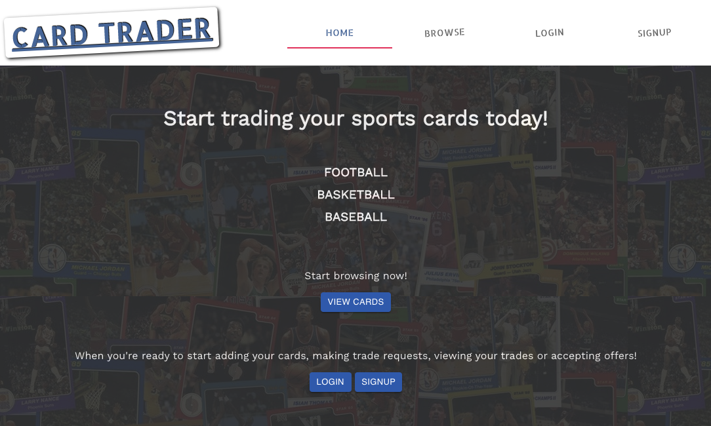

# [CardTrader](http://oncoffeeweb.com/)
This is my final project for Flatiron's Software Engineering Bootcamp. It's a Sports Card trading app that allows users to search for and make trades with other users. You can search cards by sports category, card condition or players name!

    

## Issues
* Images for cards are not permanent after being hosted on Heroku. Could be Temp Active Storage?

## Tech Stack
### Front End
* Create-react-app - Single Page Application
* React and React-Router
* Material-UI and Custom CSS for styling

### Back End
* Ruby on Rails as an API
* Rails Active Storage
* BCRYPT to secure passwords
* JWT for User Authentication
* PostgreSQL DB